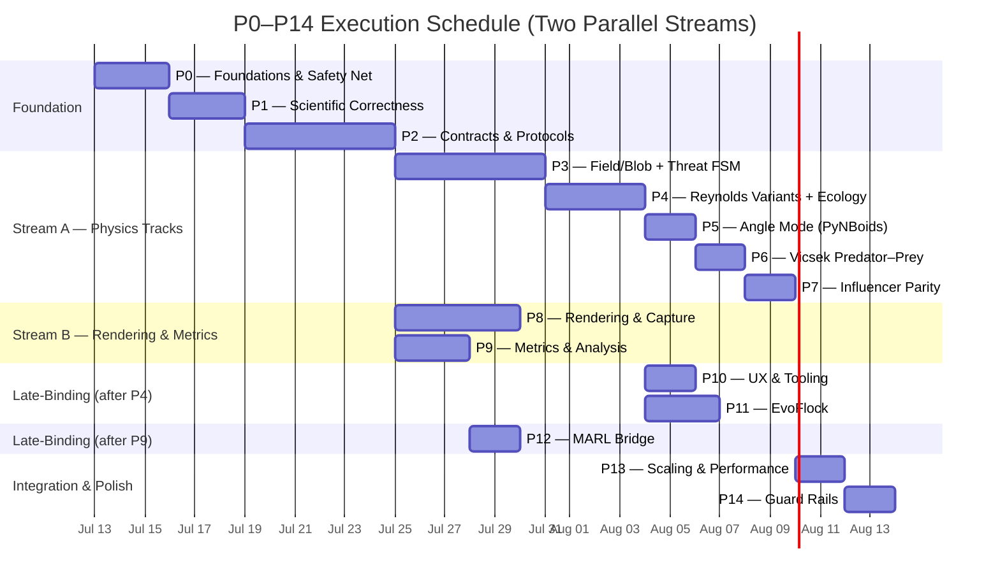

# Two-Stream Parallel Execution Schedule

> Derived from the dependency graph in `roadmap_deepseek.md`.
> **Critical path:** 29 working days (roadmap fractional estimates).
> **Gantt critical path:** 32 days (durations rounded to whole days for Mermaid).
> **Calendar time:** ~6 calendar weeks (working days) / ~7–8 weeks (wall-clock including weekends).
>
> ⚠️ **Note on Gantt vs working days:** The Gantt below uses calendar days
> (`dateFormat YYYY-MM-DD`); Mermaid has no "exclude weekends" feature. Each
> phase's `Nd` is N calendar days, which may span weekends. The roadmap's
> working-day estimates are fractional (e.g. P2 = 5.5); the Gantt rounds up
> to whole days. The visual endpoint is ~38–40 calendar days. The critical
> path discussion below uses the roadmap's actual working-day estimates (29).



> **Note on P3→P4 serialization in Stream A:** P4 technically depends on P2
> (not P3) per the roadmap dependency graph. They're serialized here under a
> single Stream A developer doing physics tracks sequentially. If staffed
> separately, P3 and P4 could start in parallel after P2 — the two-stream
> schedule models the conservative serial case.

## Phase Durations

| Phase | Roadmap Days | Gantt Days | Stream | Depends on |
|---|---|---|---|---|
| P0 | 3.0 | 3 | Foundation | — |
| P1 | 3.0 | 3 | Foundation | P0 |
| P2 | 5.5 | 6 | Foundation | P1 |
| P3 | 5.5 | 6 | **A** Physics | P2 |
| P4 | 3.5 | 4 | **A** Physics | P2 (serialized after P3) |
| P5 | 2.0 | 2 | **A** Physics | P4 |
| P6 | 1.5 | 2 | **A** Physics | P5 |
| P7 | 1.5 | 2 | **A** Physics | P6 |
| P8 | 5.0 | 5 | **B** Rendering | P2 |
| P9 | 3.0 | 3 | **B** Metrics | P2 |
| P10 | 2.0 | 2 | Late | P4 |
| P11 | 3.0 | 3 | Late | P4 |
| P12 | 2.0 | 2 | Late | P9 |
| P13 | 2.0 | 2 | Integration | P7, P8 |
| P14 | 1.5 | 2 | Polish | P13, P11 |

## Critical Path

Using the roadmap's **fractional day estimates**:

```
P0(3.0) → P1(3.0) → P2(5.5) → P3(5.5) → P4(3.5) → P5(2.0) → P6(1.5) → P7(1.5) → P13(2.0) → P14(1.5)
= 29.0 working days
```

Using the Gantt's **rounded whole-day durations**:

```
P0(3) → P1(3) → P2(6) → P3(6) → P4(4) → P5(2) → P6(2) → P7(2) → P13(2) → P14(2)
= 32 days (inflated by rounding and calendar weekends)
```

Stream B (P8:5d + P9:3d, starting after P2 at day 11.5) runs fully within
the P3–P7 window and never blocks the critical path. P10/P11 start the
moment P4 finishes (day 20.5). P12 starts after P9 finishes (day 14.5).

## Weekly Calendar (Working Days Only)

```
Week 1 (Jul 13–17):  P0 ██████ P1 ██████ P2 ██░░░░░░░░░░░░░░░░
Week 2 (Jul 20–24):  P2 ░░░░████████ P3 ████████████░░░░░░░░░░
Week 3 (Jul 27–31):  P3 ████████████ P4 ████████░░░░░░░░░░░░░░
Week 4 (Aug 3–7):    P4 ██████ P5 ████ P6 ████ P7 ████░░░░░░░░
Week 5 (Aug 10–14):  P7 ██ P13 ████ P14 ████░░░░░░░░░░░░░░░░░░
Week 6 (Aug 17–21):  <buffer / overflow>
```

> The weekly bars above use working-day estimates (not the calendar-day
> Gantt). Each `█` block ≈ 0.5 working days. Weekend gaps are invisible.

## Parallelization Strategy

| Stream | Phases | Total Days (working) | Bottleneck? |
|---|---|---|---|
| **Foundation** | P0–P2 | 11.5 | Yes — single-threaded, gates everything |
| **Stream A** (Physics) | P3–P7 | 14.0 | Yes — **critical path** |
| **Stream B** (Rendering/Metrics) | P8–P9 | 5.0 | No — finishes before P4 |
| **Late A** (UX + EvoFlock) | P10–P11 | 3.0 | No — finishes before P13 |
| **Late B** (MARL) | P12 | 2.0 | No — finishes week 3 |
| **Integration** | P13–P14 | 3.5 | Final gate |

With two developers working in parallel after P2, the total calendar time
drops from ~42 working days (single-track) to ~29 working days (~6 weeks
if weekends are excluded, ~7–8 calendar weeks including weekends).
