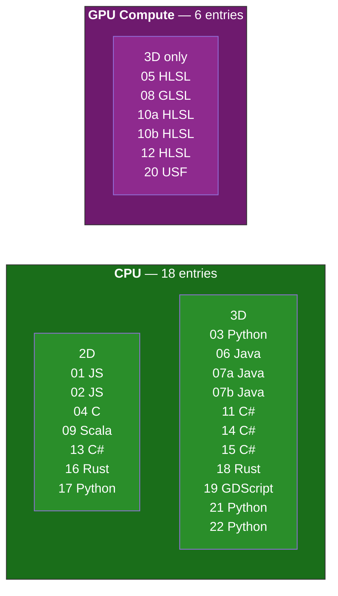

# Comparison — Extended

> Extended from sections 01–20 to include 21 (murmuration) and 22 (pymurmur).

## Index

| Section | Page |
|---------|------|
| [Comparison Table](#comparison) | Overview of all 22 entries (dimensions, steering, separation, boundaries, complexity) |
| [Feature Matrix](#feature-matrix) | Feature checklist — Reynolds, GPU, spatial, FOV, predators, noise, obstacles, etc. |
| [Cross-Reference Index](#cross-reference-index) | Where each mathematical technique appears across sections |
| [Boundary Strategies](#boundary-strategies) | Categorization: soft (force), hard (clamp), hybrid, none |
| [Speed Models](#speed-models) | Six speed control strategies — fixed, clamped, noise-modulated, etc. |
| [Conceptual Map](#conceptual-map) | Steering paradigm tree, technique sharing, platform/dimension split, steering lineage |
| [Obstacle Avoidance](#obstacle-avoidance) | Six strategies: projection, heading override, see-ahead ray, raycast, golden-spiral, SDF |
| [Neighbor Selection](#neighbor-selection) | Radius, FOV cone, k-NN, capped, global, dynamic |

---

## Comparison

| § | Dim | Steering | Separation | Boundaries | Complexity | Notable |
|:-:|:---:|----------|------------|------------|:----------:|---------|
| 01 | 2D | Force-accumulation | Linear factor | Steer-back | O(n²) | Classic original Reynolds |
| 02 | 2D | Reynolds (`desired−vel`) | 1/r² | Wrap | O(n²) | Obstacle avoidance via projection |
| 03 | 3D | Reynolds Seek/Arrive | — | — | N/A | Steering demo only (2 boids, no flock) |
| 04 | 2D | Rotation-based | Priority (closest) | Wrap | O(n²) | Three behavioral zones, scalar angles |
| 05 | 3D | Heading-blend | Equal-weight normalized | Zone-clamp | O(n²) GPU | 3D Simplex noise speed field |
| 06 | 3D | Force-accumulation | 1/r² | Spherical | O(n²) | Fixed speed, 7-neighbor cap |
| 07a | 3D | Force-accumulation | 1/r | Wrap (all 6 walls) | O(n²) | Interactive slider blending |
| 07b | 3D | Force-accumulation | 1/r | Wrap + wall-avoid | k-NN (6) | Topological neighbors + roosting + wing flap |
| 08 | 3D | Cosine-zone blend | Asymptotic 1/r² | Center attraction | O(n²) GPU | Predator, ping-pong textures, wing flap |
| 09 | 2D | Normalized + inertia | Equal-weight | Wrap | O(n²) | See-ahead ray obstacle avoidance |
| 10a | 3D | Exponential smoothing | Global avg (self-incl.) | — | O(n²) GPU | All-pairs global average |
| 10b | 3D | Exponential smoothing | Global avg (corrected) | — | O(log n) GPU | Parallel prefix-sum reduction |
| 11 | 3D | Direction-blend + momentum | FOV-weighted InverseLerp | 8-raycast avoidance | O(n²) | State machine, predators, skeletal trails |
| 12 | 3D | Reynolds | Velocity-dependent | Reflect / 1/d wall | O(n²) | CPU + GPU variants, C# limit bug noted |
| 13 | 2D | Reynolds | Exponential | Linear wall ramp | O(n²) | 1/d weighted cohesion, 30% jitter chance |
| 14 | 3D | Reynolds (alignment only) | Equal-weight | 1/d wall force | O(n²) | FOV cone, min+max speed clamp |
| 15 | 3D | Priority-ordered stack | 1/r | Spherical spring | Grid (opt.) | Wander, banking, velocity damping |
| 16 | 2D | Angle-based (±1° delta) | ±1° turn delta | Edge state machine | O(n²) | Circular mean, no velocity vectors |
| 17 | 2D | Angle-based | Distance-override | Edge-steer / Wrap | Grid | 7-nearest, circular mean, pixel trails |
| 18 | 3D | Reynolds | 1/r | Cage (constant push) | O(n²) | Golden-spiral raycast, Lissajous target |
| 19 | 3D | — | — | — | N/A | No flocking math — renderer skeleton only |
| 20 | 3D | Exponential smoothing | Linear ramp | Home force | Hashed grid + sort | Bitonic sort, value noise speed |
| 21 | 3D | Reynolds + Pearce δ̂ | 1/d² steric (Pearce SI) | Toroidal / Margin / Open | Grid (hash) | 3D spherical-cap occlusion, H₂ robustness, density scaling |
| 22 | 3D | Multi (7 modes) | Configurable kernel (sum/mean/unit) | Toroidal / Open / Margin / Sphere / Sphere_soft | Grid / KDTree (adaptive) | SDF+CSG obstacles, 11-term field forces, batched Pearce, Vicsek mode |

## Feature Matrix

Checklist of distinguishing techniques across all 22 entries.

| § | Reynolds | GPU | Spatial | FOV | Predators | Noise | Obstacles | Fixed-speed | Angle | 3D |
|:-:|:--------:|:---:|:-------:|:---:|:---------:|:-----:|:---------:|:-----------:|:-----:|:---:|
| 01 | | | | | | | | | | |
| 02 | ✓ | | | | | ✓ | ✓ | | | |
| 03 | ✓ | | | | | | | | | ✓ |
| 04 | | | | | | | | | ✓ | |
| 05 | | ✓ | | | | ✓ | ✓ | | | ✓ |
| 06 | | | | | | ✓ | | ✓ | | ✓ |
| 07a | | | | | | | | | | ✓ |
| 07b | | | ✓ | | | | | | | ✓ |
| 08 | | ✓ | | | ✓ | | | | | ✓ |
| 09 | | | | | | | ✓ | ✓ | | |
| 10a | | ✓ | | | | | | | | ✓ |
| 10b | | ✓ | | | | | | | | ✓ |
| 11 | | | | ✓ | ✓ | ✓ | ✓ | | | ✓ |
| 12 | ✓ | ✓ | | | | | | | | ✓ |
| 13 | ✓ | | | | | ✓ | | | | |
| 14 | ✓ | | | ✓ | | | | | | ✓ |
| 15 | | | ✓ | | | ✓ | ✓ | | | ✓ |
| 16 | | | | | | | | | ✓ | |
| 17 | | | ✓ | | | | | | ✓ | |
| 18 | ✓ | | | | | | ✓ | | | ✓ |
| 19 | | | | | | | | | | ✓ |
| 20 | | ✓ | ✓ | | | ✓ | | | | ✓ |
| 21 | ✓ | | ✓ | | ✓ | ✓ | | | | ✓ |
| 22 | ✓ | | ✓ | ✓ | ✓ | ✓ | ✓ | | | ✓ |

## Cross-Reference Index

Where each mathematical technique appears across all 22 entries.

### Steering

| Technique | Sections |
|-----------|----------|
| Reynolds (`desired − velocity`) | 02, 03, 12, 13, 14, 18, 21, 22 |
| Force accumulation (factor addition) | 01, 06, 07a, 07b |
| Pearce boundary-seeking δ̂ (projection) | 21, 22 |
| Field force compositing (shell/target/orbital/etc.) | 22 |
| Vicsek constant-speed alignment | 22 |
| Influencer move-then-steer | 22 |
| Heading blend (normalized sum) | 05, 11, 22 |
| Exponential heading smoothing | 05, 10a, 10b, 20 |
| Angle-based (scalar rotation, no vectors) | 04, 16, 17, 22 |
| Velocity inertia (current dir in blend) | 09, 11 |
| Priority-ordered rule selection | 04, 15 |
| Cosine-zone weighting | 08 |

### Separation

| Technique | Sections |
|-----------|----------|
| Linear factor (no distance falloff) | 01 |
| 1/r falloff (`r̂ / d`) | 07a, 07b, 15, 18 |
| 1/r² falloff (`r⃗ / d²`) | 02, 06, 21, 22 |
| Exponential decay (`exp(−(d−r)/r)`) | 13 |
| Linear ramp (`r − d`) | 20 |
| Equal-weight unit vectors | 05, 09, 14, 22 |
| Asymptotic (`r/d − 1`) | 08 |
| Distance-override (nearest neighbor) | 17 |
| Priority-zone (closest neighbor) | 04 |
| Fixed-angle delta (±1°) | 16 |
| FOV-weighted InverseLerp blend | 11 |
| Global average (center of mass) | 10a, 10b |

### Cohesion

| Technique | Sections |
|-----------|----------|
| Unweighted center of mass | 01, 04, 06, 07a, 07b, 09, 14, 15, 16, 17, 18, 20, 21, 22 |
| 1/d weighted center of mass | 13 |
| Target attraction (replaces cohesion) | 05, 10a, 10b, 22 |

### Alignment

| Technique | Sections |
|-----------|----------|
| Average velocity vector | 01, 02, 05, 06, 07a, 07b, 09, 10a, 10b, 12, 14, 15, 18, 20, 21, 22 |
| Circular mean of angles (`atan2(Σsin, Σcos)`) | 16, 17 |
| Cosine-weighted bell profile | 08 |
| FOV-weighted direction sum | 11 |
| Vicsek angular-noise alignment | 22 |

### Boundaries

| Technique | Sections |
|-----------|----------|
| Steer-back (margin turn force) | 01 |
| Wrap-around (toroidal) | 02, 04, 07a, 07b, 09, 17, 21, 22 |
| Reflective (mirror velocity) | 12 |
| Spherical confinement | 06 |
| Sphere (hard projection to surface) | 22 |
| Sphere_soft (asymptotic 1/gap push) | 22 |
| Spherical spring (`r̂ × (R − d)`) | 15 |
| Cage constant push | 18 |
| Zone clamp (slab/box/sphere) | 05 |
| Wall force (1/d or 1/d²) | 07a, 07b, 12, 14 |
| Margin (soft nudge + hard clamp) | 21, 22 |
| Linear wall ramp | 13 |
| Center/origin attraction | 08, 09 |
| Home force (inner radius dead zone) | 20 |
| Edge state machine | 16 |
| Edge-steer (margin angle override) | 17 |

### Spatial Acceleration

| Technique | Sections |
|-----------|----------|
| O(n²) all-pairs | 01, 02, 04, 05, 06, 07a, 08, 09, 10a, 11, 12, 13, 14, 15, 16, 18 |
| Grid cells (spatial hash) | 15, 17, 21 |
| Grid + KDTree (adaptive) | 22 |
| Hashed grid + bitonic sort | 20 |
| k-NN topology (6-nearest) | 07b |
| Parallel prefix-sum reduction | 10b |

### Speed Model

| Technique | Sections |
|-----------|----------|
| Clamped to max (variable speed) | 01, 02, 03, 05, 07a, 07b, 08, 11, 12, 14, 15, 16, 17, 18, 20, 21, 22 |
| Fixed (always normalized to constant) | 06, 09 |
| Noise-modulated (Simplex/value) | 05, 20 |
| Neighbor-count bonus (fewer = faster) | 17 |
| Min+max speed clamp | 14 |
| Velocity damping (friction) | 15 |

### Neighbor Selection

| Technique | Sections |
|-----------|----------|
| Radius (metric distance threshold) | 01, 02, 05, 06, 07a, 08, 09, 12, 13, 15, 16, 18, 20, 21 |
| FOV cone (`cos θ ≥ threshold`) | 11, 14, 22 |
| k-nearest-neighbor (topological) | 07b |
| 7-neighbor cap | 06, 17 |
| Dynamic vision distance adaptation | 11 |
| Hybrid metric-topological filter | 22 |
| Occlusion-based visibility (Pearce) | 21, 22 |

### Special Features

| Technique | Sections |
|-----------|----------|
| Predators | 08, 11, 21, 22 |
| Obstacle avoidance | 02, 05, 09, 11, 15, 18, 22 |
| Random jitter (uncorrelated) | 02, 06, 11, 13, 22 |
| Procedural noise field (Simplex/value) | 05, 20 |
| Wander behavior (Reynolds) | 15 |
| State machine | 11, 16 |
| Wing flap animation | 07b, 08 |
| Skeletal trail animation | 11 |
| Physical measurements (power, momentum) | 06 |
| Pixel trail fading | 17 |
| GPU compute shader | 05, 08, 10a, 10b, 12, 20 |
| Ping-pong textures | 08 |
| Mouse-driven target (ray-plane) | 03 |
| Look-at matrix (GPU instancing) | 20 |
| No flocking math (skeleton only) | 19 |
| H₂ robustness (Young 2013) | 21 |
| Density scaling analysis | 21 |
| Flock shape PCA | 21 |
| Correlation time τρ | 21 |
| Scientific metrics (polarisation, opacity, AM) | 21, 22 |
| Batched parallel occlusion | 22 |
| SDF + CSG obstacle system | 22 |
| 7 interchangeable flocking modes | 22 |
| 11-term force-field compositing | 22 |
| Vicsek self-propelled particles | 22 |
| Multi-core occlusion culling | 22 |
| Adaptive spatial index (grid ↔ KDTree) | 22 |
| Per-interaction FOV perception cones | 22 |
| Predator-prey species built into boids | 22 |

## Boundary Strategies

How each implementation keeps boids within the simulation volume, categorized as **soft** (force nudges velocity), **hard** (position teleport/clamp), or **hybrid** (both mechanisms).

### By Category

**Soft — force nudges velocity, no position override:**

| § | Strategy | Mechanism |
|:-:|----------|-----------|
| 01 | Steer-back | Constant `turnFactor` added to velocity when within `margin` of edge |
| 08 | Center attraction | Constant pull toward origin (`−normalize(toCenter) × Δt × 5.2`), Y-amplified (×2.5) to discourage altitude |
| 11 | Obstacle-based | 8-directional raycast avoidance — no world boundary, open/infinite volume defined by obstacles |
| 13 | Linear wall ramp | Steer force ramps linearly from 0 at `AvoidWallsDistance` to 1 at the wall edge |
| 14 | 1/d wall repulsion | Six-face force `wallWeight × wallDistance / |dist|` — grows asymptotically as distance → 0 |
| 15 | Spherical spring | `normalize(toCenter) × (sphereRadius − distance)` — linear spring outside boundary |
| 18 | Cage constant push | Constant ±0.5 push on each axis when within 0.5 units of cage wall |
| 20 | Home force | Attraction toward origin with inner-radius dead zone — inactive inside `homeInnerRadius` |

**Hard — position directly modified:**

| § | Strategy | Mechanism |
|:-:|----------|-----------|
| 02 | Wrap-around | `if pos > width: pos = 0` — toroidal teleport on all 4 edges |
| 04 | Wrap-around (modulo) | `MODULO(origin + velocity × Δt, screenSize)` — true mathematical modulo on both axes |
| 05 | Zone clamp | Position clamped inside slab (Y-only), box (all axes), or sphere (radius cap) in local space with world↔local matrix transforms |
| 09 | Wrap-around (if-else) | Chain of `if/else if` on each edge — note: wrapping and movement are mutually exclusive (boid stops while teleported) |

**Hybrid — soft force combined with hard override:**

| § | Strategy | Mechanism |
|:-:|----------|-----------|
| 06 | Spherical confinement + behavioral override | Soft: inward push `normalize(position) × AVOIDANCE_FACTOR` when outside radius. Hard: acceleration is **skipped entirely** while outside — boundary avoidance overrides all flocking |
| 07a | Wrap + 6-wall force | Hard: wrap on all 6 box faces. Soft: `1/d² × 5` repulsion from each wall added to acceleration before wrap |
| 07b | Wrap + wall force (asymmetric) | Hard: Y-axis wrap only. Soft: ground strongly avoided (×5), other walls weakly (×0.1), top wall open |
| 12 | Reflective + wall force | Hard: position clamped to boundary + velocity component mirrored (`vel.x = −vel.x`). Soft (GPU only): `1/d` wall repulsion force applied after force clamping |
| 16 | Wrap + edge state machine | Hard: screen wrap with `EDGE_BLEED` buffer zone. Soft: three-level state machine (Idle → Turning → TurningHarder) with exponential flocking attenuation, half-speed turns, and 65° saturation cap |
| 17 | Edge-steer + optional wrap | Soft: when within `margin`, flocking is overridden and angle is set to face away from nearest edge with ramped turn rate (from `turnRate` up to 20). Hard: optional `WRAP` mode teleports to opposite edge |
| 21 | Hybrid (multi-mode) | Default: toroidal `pos %= size` on all 3 axes. Also supports **margin** (soft nudge + hard clamp) and **open** (no enforcement) |
| 22 | Hybrid (multi-mode) | Default: toroidal `pos %= size`. Also supports **open**, **margin** (soft + hard), **sphere** (hard projection to surface), **sphere_soft** (asymptotic 1/gap push) — 5 modes total |

**None — no boundary handling:**

| § | Reason |
|:-:|--------|
| 03 | Steering demo only — 2 boids chase a mouse target, no world boundaries |
| 10a | Global-average flocking with target attraction — boids float freely, no confinement |
| 10b | Same as 10a — parallel reduction variant also has no boundary |
| 19 | No flocking math implemented — renderer skeleton only |

### Patterns

- **Wrap-around is the most common hard strategy** (02, 04, 07a, 07b, 09, 16, 17) — 9 of 22 entries wrap at least one axis.
- **Soft-only approaches dominate 3D** — 6 of the 8 soft-only implementations are 3D (08, 11, 14, 15, 18, 20); hard position clamping in 3D is more complex (05 uses matrix transforms, 12 is reflective).
- **Hybrid strategies appear in feature-rich implementations** — they combine the reliability of hard teleport/clamp with the natural look of soft steering forces.
- **Only 2 implementations have no boundary at all with real flocking** (10a, 10b) — they rely on target attraction to keep boids loosely centered.
- **Section 05 is unique** in using a full local-space containment system (slab, box, sphere) with matrix transforms — the most sophisticated hard boundary in the set.
- **Section 16 is unique** in using a 3-level edge state machine with exponential flocking attenuation and speed modulation — the most elaborate soft boundary.

## Speed Models

How each implementation controls boid velocity magnitude. Six distinct strategies are used across the 22 entries.

### Fixed Speed

Velocity magnitude is forced to a constant every frame — steering only changes direction, never speed.

| § | Mechanism | Constant |
|:-:|-----------|----------|
| 04 | Scalar speed projected via sin/cos from rotation angle | `speed = (20, 20)` always |
| 06 | Velocity normalized then scaled | `|v| = FLIGHT_SPEED` (adjustable) |
| 09 | Velocity normalized then scaled | `|v| = topSpeed = 3` |
| 10a | Velocity baked into position update, heading only changes direction | `|v| = moveSpeed = 1` |
| 10b | Same as 10a | `|v| = moveSpeed = 1` |

### Clamped Variable

Speed varies naturally from steering forces, then capped at a maximum (or min+max range) each frame.

**Normalize-then-scale** — direction preserved, magnitude reset to exactly maxSpeed when over limit:

| § | Mechanism | Limit |
|:-:|-----------|-------|
| 01 | `if speed > limit: (dx, dy) × limit / speed` | `speedLimit = 15` |
| 03 | `if |v| > maxSpeed: normalize(v) × maxSpeed` | `maxSpeed = 0.1` or `1.0` |
| 08 | `if |v| > limit: normalize(v) × limit` | `10` (normal) / `15` (fleeing) |
| 13 | `Velocity ×= MaxSpeed / speed` | `MaxSpeed = 9` |

**Direct truncation** — magnitude capped without re-normalizing first:

| § | Mechanism | Limit |
|:-:|-----------|-------|
| 02 | `if |v| > maxSpeed: |v| = maxSpeed` | `maxSpeed = 6` |

**Min + max clamp** — both lower and upper bounds enforced:

| § | Mechanism | Range |
|:-:|-----------|-------|
| 14 | `clamp(|v|, minSpeed, maxSpeed) × dir` | `[2, 5]` — boids cannot stop |

**With damping** — slight friction reduces speed every frame:

| § | Mechanism | Damping |
|:-:|-----------|---------|
| 15 | `velocity ×= (1 − damping × Δt)` after clamp to maxSpeed | `damping = 0.01` |

**Basic clamp** — standard limit via normalization or truncation:

| § | Mechanism | Limit |
|:-:|-----------|-------|
| 07a | `limit(vel, maxSpeed)` | `maxSpeed = 2` |
| 07b | Same as 07a | `maxSpeed = 2` |
| 12 | `LimitVector(velocity, maxVelocity)` | `maxVelocity = 0.1` |
| 18 | `clamp(velocity, maxSpeed)` | `maxSpeed = 4.0` |

**State-dependent speed** — speed varies by behavioral mode:

| § | Mechanism | Modes |
|:-:|-----------|-------|
| 16 | Random per-boid speed range. Halved in `Turning` state, full speed in `TurningHarder`, normal otherwise | 3 edge states modulate speed |
| 21 | Band clamp `[0.3·V₀, V₀]` — prevents stalling with floor, caps overspeed | `v0 = 4` |
| 22 | Band clamp `[0.3·v0, v0]` — configurable via `speed_mode` (`band` / `fixed` / `ceiling` / `none`) with inertia lerp | `v0 = 4` |

### Noise-Modulated

Speed is a continuous function of the boid's position in a procedural noise field, creating organic slow/fast zones.

| § | Noise Type | Formula |
|:-:|------------|---------|
| 05 | 3D Simplex | `moveSpeed × lerp(0.5, 2.0, noiseSample^3.0)` |
| 20 | 3D value noise | `boidSpeed × (1 + noise × 1.0)` per-boid hash offset |

### Neighbor-Count Adaptive

Isolated boids fly faster; surrounded boids slow down — speed is a function of local density.

| § | Formula | Range |
|:-:|---------|-------|
| 17 | `baseSpeed + (7 − neighborCount) × bonus` | `speed` to `speed + 7×bonus` when alone |

| Variant | Bonus formula |
|---------|--------------|
| pynboids2 | `speed + (7−n) × 2` |
| pynboids | `180 + (7−n)²` |
| pynboids_sp | `speed + (7−n) × 5` |
| pixelboids | `speed + (7−n) / 14` |

### Velocity-Adaptive

Speed smoothly approaches a state-dependent target, with randomized bonus multipliers and asymmetric acceleration rates.

| § | Mechanism |
|:-:|-----------|
| 11 | `goal = baseVelocity[state] × randomBonusFactor`. Velocity lerps toward goal at rate `accel × Δt` (normal) or `emergencyAccel × Δt` (AFRAID/ATTACKING). Bonus factor randomly re-rolls every period from `[minFactor, maxFactor]` |

### None

| § | Reason |
|:-:|--------|
| 19 | No flocking math — renderer skeleton only |

### Patterns

- **Clamped-variable is the most common model** — 14 of 22 entries use some form of speed clamping (01, 02, 03, 07a, 07b, 08, 12, 13, 14, 15, 16, 18, 21, 22), plus section 04 which achieves constant speed through trigonometric projection.
- **Fixed-speed implementations enforce constant magnitude every frame** — either via velocity normalization (06, 09, 10a, 10b) or trigonometric projection from a scalar angle (04). They sacrifice speed variation for predictable, uniform movement.
- **Only two implementations use procedural noise for speed** (05, 20) — both are GPU compute shader implementations where noise lookups are cheap.
- **Section 14 is the only implementation with a minimum speed** — boids cannot stop, ensuring the flock never stagnates.
- **Section 15 is the only implementation with velocity damping** — a slight friction term that bleeds speed over time, requiring continuous steering to maintain velocity.
- **Section 17 is the only implementation that adapts speed to local density** — isolated boids speed up to rejoin the flock, a biologically motivated design.
- **Section 11 has the richest speed model** — state-dependent targets, randomized per-boid bonuses, and asymmetric acceleration (emergency vs normal).
- **Section 16 modulates speed by edge proximity** — the only implementation where boundary state directly controls movement speed.

## Conceptual Map

How the 22 entries relate — by steering paradigm, shared techniques, and platform dimensions.

### Steering Paradigm Tree

Every implementation branches from one of six core steering approaches.

```mermaid
graph TD
    ROOT["<b>Boids Flocking</b><br/>22 entries"]

    ROOT --> REY["<b>Reynolds Steering</b><br/><i>desired − velocity</i><br/>8 entries"]
    ROOT --> FORCE["<b>Force Accumulation</b><br/>direct factor addition<br/>4 entries"]
    ROOT --> ANGLE["<b>Angle-based</b><br/>scalar rotation, no vectors<br/>3 entries"]
    ROOT --> HEAD["<b>Heading Blend</b><br/>normalized force sum<br/>2 entries"]
    ROOT --> EXPO["<b>Exponential Smoothing</b><br/>lerp toward target heading<br/>3 entries"]
    ROOT --> SPEC["<b>Unique Approaches</b><br/>one of a kind<br/>4 entries"]

    REY --> R02["02 JS Canvas<br/>▸ obstacles, noise"]
    REY --> R03["03 Panda3D<br/>▸ seek/arrive demo"]
    REY --> R12["12 Unity GPU<br/>▸ reflective + wall force"]
    REY --> R13["13 Blazor<br/>▸ exponential separation"]
    REY --> R14["14 Unity ECS<br/>▸ FOV cone"]
    REY --> R18["18 Rust+Bevy<br/>▸ golden-spiral raycast"]
    REY --> R21["21 Python+OpenGL<br/>▸ Pearce projection + H₂"]
    REY --> R22["22 Python (pymurmur)<br/>▸ 7 modes + SDF obstacles"]

    FORCE --> F01["01 Vanilla JS<br/>▸ classic original"]
    FORCE --> F06["06 Processing<br/>▸ fixed speed + spherical"]
    FORCE --> F07a["07a fish_sliders<br/>▸ interactive sliders"]
    FORCE --> F07b["07b starlings<br/>▸ k-NN topology + roosting"]

    ANGLE --> A04["04 C+Raylib<br/>▸ priority zones"]
    ANGLE --> A16["16 Rust+Nannou<br/>▸ edge state machine"]
    ANGLE --> A17["17 Pygame<br/>▸ grid + pixel trails"]

    HEAD --> H05["05 Unity GPU<br/>▸ Simplex noise + obstacles"]
    HEAD --> H11["11 Unity 3D<br/>▸ FOV + predators + skeletal"]

    EXPO --> E10a["10a Unity GPU<br/>▸ O(n²) global average"]
    EXPO --> E10b["10b Unity GPU<br/>▸ parallel prefix-sum"]
    EXPO --> E20["20 Unreal GPU<br/>▸ hashed grid + bitonic sort"]

    SPEC --> S08["08 WebGL GPU<br/>▸ cosine-zone + predator"]
    SPEC --> S09["09 Scala<br/>▸ velocity inertia blend"]
    SPEC --> S15["15 Unity DOTS<br/>▸ priority stack + wander"]
    SPEC --> S19["19 Godot<br/>▸ skeleton — no math"]

    style ROOT fill:#222,color:#fff,stroke:#555
    style REY fill:#1a5276,color:#fff
    style FORCE fill:#1a5276,color:#fff
    style ANGLE fill:#1a5276,color:#fff
    style HEAD fill:#1a5276,color:#fff
    style EXPO fill:#1a5276,color:#fff
    style SPEC fill:#1a5276,color:#fff
    style S19 fill:#922,color:#fff
```



### Technique Sharing Map

Cross-cutting features that span steering paradigms — implementations grouped by what they share, not how they steer.

```mermaid
graph TD
    REY["<b>Reynolds Steering</b>"] --> R02(02) & R03(03) & R12(12) & R13(13) & R14(14) & R18(18) & R21(21) & R22(22)
    GPU["<b>GPU Compute</b>"] --> G05(05) & G08(08) & G10a(10a) & G10b(10b) & G12(12) & G20(20)
    SPAT["<b>Spatial Partitioning</b>"] --> S07b("07b k-NN") & S15("15 grid") & S17("17 grid") & S20("20 hashed") & S21("21 grid") & S22("22 grid+KDTree")
    FOV["<b>FOV Cone</b>"] --> F11(11) & F14(14) & F22(22)
    PRED["<b>Predators</b>"] --> P08(08) & P11(11) & P21(21) & P22(22)
    NOISE["<b>Procedural Noise</b>"] --> N02(02) & N05(05) & N06(06) & N11(11) & N13(13) & N15(15) & N20(20) & N21(21) & N22(22)
    OBS["<b>Obstacle Avoidance</b>"] --> O02(02) & O05(05) & O09(09) & O11(11) & O15(15) & O18(18) & O22(22)
    FIX["<b>Fixed Speed</b>"] --> FS06(06) & FS09(09)

    style REY fill:#1a5276,color:#fff
    style GPU fill:#6e1a6e,color:#fff
    style SPAT fill:#1a6e1a,color:#fff
    style FOV fill:#b8860b,color:#fff
    style PRED fill:#922,color:#fff
    style NOISE fill:#0b6eb8,color:#fff
    style OBS fill:#6e4a1a,color:#fff
    style FIX fill:#555,color:#fff
```



### Platform & Dimension Split



> **Note**: All 6 GPU implementations are 3D. No GPU implementation targets 2D. The 2D implementations (7 total) are all CPU-based. Sections 21 and 22 add 2 more CPU 3D entries.

### Steering Lineage

How ideas evolved from the classic original through successive implementations.

```
01 · Classic Original (2010s)
│  └─ Factor-based force accumulation, steer-back boundaries
│
├─► 02 · Reynolds Formalization
│     └─ Proper steer = desired − velocity, 1/r² separation, obstacles
│
├─► 04 · Angle-based Branch
│     ├─► 16 · Edge state machine, circular mean
│     └─► 17 · Spatial grid, pixel trails, 7-nearest cap
│
├─► 05 · GPU Era Begins
│     ├─► 08 · Cosine-zone weighting, ping-pong textures, predator
│     ├─► 10a/10b · Exponential smoothing, parallel reduction
│     ├─► 12 · Reynolds on GPU, reflective boundaries
│     └─► 20 · Hashed grid + bitonic sort, value noise
│
├─► 06/07 · Processing Research
│     ├─► 07b · Topological k-NN (starling research)
│     └─► 06 · Physical measurements, spherical confinement
│
├─► 11 · Feature-Rich Peak
│     └─ FOV, predators, state machine, skeletal trails, raycast avoidance
│
├─► 13 · Web Assembly
│     └─ Exponential separation, 1/d weighted cohesion
│
├─► 14/15 · ECS Architecture
│     ├─► 14 · FOV cone, min+max speed, multi-framework
│     └─► 15 · Priority stack, wander, banking, damping, Burst
│
└─► 18 · Physics Integration
      └─ Golden-spiral raycast, Rapier physics, Lissajous target

├─► 21 · Scientific Murmuration
│     └─ Pearce 2014 projection, H₂ robustness, density scaling, correlation time
│
└─► 22 · Feature-Complete Engine
      └─ 7 flocking modes, SDF+CSG obstacles, batched Pearce, Vicsek, field forces

19 · Godot Skeleton (no flocking math)
```

### ASCII Art Tree

```
Boids Flocking (26 branches, 22 unique entries)
│
├─ Reynolds Steering (8) ──────────────────────────────────────────────────────
│  ├─ 02  JS Canvas          ▸ obstacles + noise
│  ├─ 03  Panda3D            ▸ seek/arrive demo (no flock)
│  ├─ 12  Unity GPU          ▸ reflective bounds + wall force
│  ├─ 13  Blazor             ▸ exponential separation
│  ├─ 14  Unity ECS          ▸ FOV cone + min/max speed
│  ├─ 18  Rust + Bevy        ▸ golden-spiral raycast + cage
│  ├─ 21  Python + PyOpenGL  ▸ Pearce δ̂ + H₂ + density scaling
│  └─ 22  Python (pymurmur)  ▸ 7 modes + SDF + Vicsek + field forces
│
├─ Force Accumulation (4) ─────────────────────────────────────────────────────
│  ├─ 01  Vanilla JS         ▸ classic original
│  ├─ 06  Processing         ▸ fixed speed + spherical confinement
│  ├─ 07a Processing         ▸ interactive slider blending
│  └─ 07b Processing         ▸ k-NN topology + roosting + wing flap
│
├─ Angle-based (3) ────────────────────────────────────────────────────────────
│  ├─ 04  C + Raylib         ▸ priority zones
│  ├─ 16  Rust + Nannou      ▸ edge state machine + circular mean
│  └─ 17  Python + Pygame    ▸ spatial grid + pixel trails + 7-nearest
│
├─ Heading Blend (2) ──────────────────────────────────────────────────────────
│  ├─ 05  Unity GPU          ▸ 3D Simplex noise + zone containment
│  └─ 11  Unity 3D           ▸ FOV + predators + skeletal trails + state machine
│
├─ Exponential Smoothing (3) ──────────────────────────────────────────────────
│  ├─ 10a Unity GPU          ▸ O(n²) all-pairs global average
│  ├─ 10b Unity GPU          ▸ parallel prefix-sum reduction
│  └─ 20  Unreal Engine 5    ▸ hashed grid + bitonic sort + value noise
│
├─ Pearce Projection (2) ──────────────────────────────────────────────────────
│  ├─ 21  Python + PyOpenGL  ▸ spherical-cap occlusion + H₂ + density scaling
│  └─ 22  Python (pymurmur)  ▸ batched parallel occlusion + multi-mode engine
│
└─ Unique Approaches (4) ──────────────────────────────────────────────────────
   ├─ 08  WebGL GPU          ▸ cosine-zone weighting + predator + ping-pong
   ├─ 09  Scala              ▸ velocity inertia + see-ahead ray
   ├─ 15  Unity DOTS         ▸ priority-ordered stack + wander + banking
   └─ 19  Godot              ▸ skeleton — no flocking math
```

## Obstacle Avoidance

Seven of the 22 entries include obstacle avoidance. Each uses a fundamentally different detection-and-response mechanism.

### Overview

| § | Strategy | Detection | Response | Steering Override |
|:-:|----------|-----------|----------|:-----------------:|
| 02 | Orthogonal projection | Per-obstacle miss distance check | Steer away from closest threat's `−perp` | Partial (weighted force) |
| 05 | Hard heading override | Nearest obstacle surface distance | Compute avoid point, set heading directly | **Full** (flocking ignored) |
| 09 | See-ahead ray | 3 sample points (ahead, half, self) | Steer away from closest threat | Partial (vector sum with inertia) |
| 11 | 8-directional raycast | Forward raycast hit trigger | Blend original + avoidance dir by distance, raycast-verify | Partial (direction blend) |
| 15 | Single raycast feeler | Forward raycast hit | `normal × (feelerDepth / dist)` — 1/d force | **Highest priority** in stack |
| 18 | Golden-spiral sampling | Forward raycast hit trigger | Sample 1500 directions for first clear path | Partial (added to separation) |
| 22 | SDF gradient + TTC | Sign change (SDF crossing) + closing velocity | Static fly-away (ramp) + predictive time-to-collision urgency | Partial (added to acceleration) |

### Strategy Details

#### 02 — Orthogonal Projection

The boid computes how far it would miss each obstacle if it continued on its current heading. Only obstacles within a perpendicular miss threshold trigger avoidance.

```
disp = obstacle.position − B.position
perp = disp − B.velocity × (disp · B.velocity) / |B.velocity|²    // component orthogonal to heading

if |perp| < obstacle.affectRadius:
    obstacleVector = −perp    // steer perpendicularly away
```

**Key property**: The boid only reacts if it's on a collision course — obstacles far to the side are ignored even if nearby. The closest obstacle wins (not the strongest signal).

---

#### 05 — Hard Heading Override

Finds the single nearest obstacle. If the boid is within `obstacleAversionDistance` of its surface, the flocking heading is **completely replaced** with a direct avoidance heading.

```
nearest = argmin( d(B.position, obstacle.position) ) over all obstacles
distToSurface = d(B.position, nearest.position) − nearest.radius

if distToSurface < obstacleAversionDistance:
    avoidDir    = normalize(B.position − nearest.position)
    avoidPoint  = nearest.position + avoidDir × (nearest.radius + obstacleAversionDistance)
    finalHeading = normalize(avoidPoint − B.position)    // ← bypasses all flocking
else:
    finalHeading = normalHeading    // ← normal flocking
```

**Key property**: This is the only strategy that **completely overrides** flocking behavior. When triggered, separation, alignment, and target forces are all ignored. The avoid point is placed beyond the influence zone, giving the boid a clear target to aim for.

---

#### 09 — See-Ahead Ray

Projects a "whisker" ray in the boid's forward direction and checks three sample points for obstacle intersections.

```
ahead     = B.position + normalize(B.velocity) × seeAhead
aheadHalf = ahead × 0.5

intersects(B, obstacle) = 
    d(ahead, obstacle.pos) ≤ obstacle.radius × 1.2 OR
    d(aheadHalf, obstacle.pos) ≤ obstacle.radius × 1.2 OR
    d(B.position, obstacle.pos) ≤ obstacle.radius × 1.2

threat = argmin(d(B.position, o.pos)) over intersected obstacles
avoidance = normalize(ahead − threat.position)    // if threat exists
```

**Key property**: Three-point sampling (ahead, mid, self) provides graduated detection — the boid reacts earlier than single-point raycasts. The 1.2× radius multiplier adds a safety margin. Avoidance enters the velocity vector sum alongside flocking forces, with the highest weight (`avoidanceWeight = 85`).

---

#### 11 — 8-Directional Raycast with Distance-Weighted Blending

When a forward raycast hits an obstacle, 8 perpendicular avoidance directions are generated, each blended with the original heading based on obstacle proximity, then raycast-verified for clearance.

```
// Generate 8 directions orthogonal to heading:
dirs = [axis1, −axis1, (axis1+axis2)/√2, (axis1−axis2)/√2,
        (−axis1+axis2)/√2, (−axis1−axis2)/√2, axis2, −axis2]

for each avoidDir:
    perceivedDist = Remap(hitDist, margin, raycastDist, 0, raycastDist)
    blendedDir = normalize(originalDir × perceivedDist
                         + avoidDir × (raycastDist − perceivedDist))
    // raycast in blendedDir — if clear, use it
```

**Key properties**:
- **Distance-weighted blend**: when obstacle is far, the original direction dominates; when close, avoidance direction dominates
- **Raycast verification**: blended directions are tested before adoption — no blind steering
- **Boid vs predator bias**: boids use random reference (no directional bias); predators use `Vector3.up` reference (prefer horizontal avoidance)

---

#### 15 — Single Raycast Feeler

A simple forward raycast. On hit, a 1/d repulsion force is generated and enters the **highest-priority slot** in the force accumulation stack.

```
forward = normalize(rotation × (0,0,1))
raycast from position to position + forward × forwardFeelerDepth

if hit:
    dist = distance(hit.point, position)
    force = hit.normal × (forwardFeelerDepth / dist)    // 1/d, grows as obstacle nears

obstacle.force = force
```

**Key property**: The `feelerDepth / dist` term produces asymptotic repulsion at close range. Because obstacle force enters the priority stack **first**, it takes precedence over all flocking behaviors — if the obstacle force saturates the `maxForce` budget, no other forces are applied.

---

#### 18 — Golden-Spiral Direction Sampling

Forward raycast along velocity. On hit, samples 1500 pre-generated directions distributed on a sphere via golden angle, filtered to a 270° forward FOV, searching for the first unobstructed path.

```
φ = (1 + √5) / 2                                         // golden ratio
angle_inc = 2π × φ
cos_threshold = cos(135°) ≈ −0.707                        // 270° FOV

for i in 0..1500:
    t = i / 1500
    inclination = acos(1 − 2t)                            // uniform sphere distribution
    azimuth = angle_inc × i
    dir = (sin(incl) × cos(az), sin(incl) × sin(az), cos(incl))
    if dir · (0, 0, 1) ≥ cos_threshold:                   // within forward FOV
        directions.push(dir)

// On raycast hit:
hit = rapier.cast_ray(position, velocity, 4.0, true, only_fixed)
if hit:
    free_dir = first unobstructed direction from pre-generated set
    separation += free_dir
```

**Key properties**:
- **1500 pre-generated directions** — exhaustive sampling avoids local minima
- **Golden spiral** ensures uniform sphere coverage — no directional bias
- **270° FOV** means the boid can turn almost completely around if needed
- **Added to separation** rather than overriding — the avoidance acts as an additional force, not a replacement

---

#### 22 — SDF Gradient + Predictive Time-to-Collision

Uses signed distance functions (spheres, boxes, cylinders) with CSG union/subtract to define obstacle geometry. Two avoidance mechanisms:

**Static fly-away:**
```
if 0 ≤ SDF(p) < fly_away_max_dist:
    ramp = 1 − SDF(p) / fly_away_max_dist
    a += ∇SDF × static_weight × ramp         // push along outward normal
```

**Predictive time-to-collision:**
```
closing = −∇SDF · v                           // positive = approaching surface
if closing > 0 and SDF(p) ≥ 0:
    ttc = SDF(p) / closing                     // time to collision
    if ttc < min_time_to_collide:
        a += ∇SDF × predictive_weight          // urgent avoidance
```

**Kinematic correction** (Newton step) for penetration recovery:
```
p_corrected = p − SDF(p) × ∇SDF / |∇SDF|²
```

**Key properties**:
- **Arbitrary geometry** via CSG — any combination of primitives, not just spheres/circles
- **Collision detection** via sign change: `sign(SDF_old) > 0 AND sign(SDF_new) < 0`
- Unlike all other implementations, obstacle geometry is **volumetric** (inside/outside defined by SDF sign) rather than surface-based

### Patterns

- **Most strategies are force-based, not overrides** — only 05 completely replaces the heading; the others add obstacle avoidance as a weighted force or prioritized term.
- **Raycast-based detection dominates** (09, 11, 15, 18) — 4 of 7 use raycasts, while 02 uses geometric projection, 05 uses simple distance checks, and 22 uses SDF gradient evaluation.
- **Section 18's golden-spiral approach is unique** — it's the only strategy that pre-generates and samples a large set of directions rather than computing avoidance analytically.
- **Section 22's SDF+CSG approach is unique** — the only strategy using signed distance functions for volumetric obstacle geometry, enabling arbitrary compound shapes via constructive solid geometry.
- **Priority matters as much as mechanism** — 05 and 15 give obstacle avoidance highest priority (full override / priority stack), while 02, 09, 11, 18, and 22 blend it with flocking forces.
- **Safety margins vary**: 09 uses 1.2× radius, 11 uses configurable `obstacleBaseMargin`, 05 uses `obstacleAversionDistance`, 02 uses `obstacleAffectRadius`, 22 uses `fly_away_max_dist`.
- **Only 11 and 22 distinguish between entity types** — 11 biases boids vs predators in raycast avoidance; 22 builds predator-prey into the boid species system.

## Neighbor Selection

How each implementation chooses which other boids to consider for flocking. Five distinct strategies across 22 entries.

### Overview

| § | Strategy | Details |
|:-:|----------|---------|
| 01 | Radius | Single `visualRange = 75` for all three rules |
| 02 | Radius | Two radii: `followRadius = 100`, `avoidRadius = 30` |
| 03 | — | No neighbor selection (only 2 boids) |
| 04 | Radius | Single `neighborRadius = 50` |
| 05 | Radius | Single `cellRadius = 5` |
| 06 | Radius + cap | `INFLUENCE_CIRCLE = 80`, `MIN_SEP = 50`; alignment at 0.75× circle; cap at 7 |
| 07a | Radius | Single `neighborhoodRadius = 100` |
| 07b | **k-NN topological** | Always exactly 6 closest boids; radius = 400 as fallback only |
| 08 | Radius (3 zones) | Three concentric zone radii combining into `radii_sector` |
| 09 | Radius | Single `detectionRadius = 50` |
| 10a | **Global** | All boids (self-inclusive), no distance filter |
| 10b | **Global** | All boids via prefix-sum, no per-boid distance filter |
| 11 | **FOV cone** | `cos(angle) ≥ cos(visionSemiAngle)` gates all perception; vision distance adapts dynamically |
| 12 | Radius | Single `insightRange = 3` |
| 13 | Radius | `PerceptionRadius = 50`; separation uses `2 × SeparationDistance = 40` |
| 14 | **FOV cone + radius** | Both distance (`neighborDistance = 1`) AND forward hemisphere (`cos(90°) = 0`) must pass |
| 15 | Radius | Single `neighbourDistance = 20`; optional grid acceleration |
| 16 | Radius (2 zones) | `BIRD_REGION_RADIUS = 225` for cohesion/alignment, `BIRD_SEPARATION_RADIUS = 30` |
| 17 | Radius + cap | Perception radius varies by variant; always capped at 7 nearest; optional grid |
| 18 | Radius (3 zones) | `separation = 1.0`, `alignment = 1.0`, `cohesion = 1.5` — three independent radii |
| 19 | — | No flocking math |
| 20 | Radius (2 zones) | `neighbourDistance = 10.0` for cohesion/alignment, `separationDistance = 3.0` |
| 21 | Radius + occlusion | 200-unit grid query → closest-first visibility sort → top σ=4 visible — occlusion-based filtering (Pearce) |
| 22 | Hybrid (metric + k-NN + FOV) | Up to `influence_count=7` within detection range, optional per-interaction FOV cones, grid or KDTree query |

### Radius-Based (Metric Distance)

The dominant strategy — 16 of 22 entries use a simple Euclidean distance threshold.

**Single-radius** — one threshold for all behaviors:

| § | Radius | Notes |
|:-:|--------|-------|
| 01 | 75 | All three rules share one radius |
| 04 | 50 | Priority zones use sub-thresholds (5, 10, 30) |
| 05 | 5 | GPU compute, O(n²) per boid |
| 07a | 100 | Interactive slider blending |
| 09 | 50 | All rules output normalized unit vectors |
| 12 | 3 | Small world units |
| 15 | 20 | Optional grid acceleration reduces to O(n·k) |

**Multi-radius** — different radii for different behaviors:

| § | Separation | Alignment | Cohesion | Notes |
|:-:|:----------:|:---------:|:--------:|-------|
| 02 | 30 | 100 (followRadius) | 100 | Two radii, separation uses tighter |
| 06 | 50 (MIN_SEP) | 60 (0.75×80) | 80 | Alignment uses inner 75% of circle |
| 08 | `seperation_distance` | `alignment_distance` | `cohesion_distance` | Three concentric zones, GPU uniform inputs |
| 13 | 40 (2×20) | 50 | 50 | Separation zone is tighter than perception |
| 16 | 30 | 225 | 225 | Drastic ratio: cohesion radius is 7.5× separation |
| 18 | 1.0 | 1.0 | 1.5 | Cohesion reaches further than other rules |
| 20 | 3.0 | 10.0 | 10.0 | Separation is a tight inner zone |

### FOV Cone

Three implementations add a directional constraint — only boids within a forward-facing cone are considered neighbors, regardless of distance within range.

#### 11 — Cosine Threshold with Dynamic Adaptation

```
cosAngle = (entityPosition − myPosition).normalized · myDirection
if cosAngle ≥ cosVisionSemiAngle:  entity is in FOV
```

The vision cone angle is fixed, but the **vision distance** adapts every frame:

```
if nbInFOV > idealNbNeighbors:  visionDistance = max(1, visionDistance − 1)
if nbInFOV < idealNbNeighbors:  visionDistance = min(maxVision, visionDistance + 1)
```

This creates a feedback loop — isolated boids expand their vision to find flockmates; crowded boids narrow it.

#### 14 — Forward Hemisphere

```
prodThresh = cos(neighborFov) = cos(90°) = 0
d̂ = normalize(other.pos − self.pos)
f̂ = normalize(self.velocity)
if dot(f̂, d̂) > 0:  neighbor is in forward hemisphere
```

At 90°, the entire 180° forward arc is included — boids cannot see anyone behind them. Used in conjunction with a distance threshold (`neighborDistance = 1`).

#### 22 — Per-Interaction Perception Cones

Optional FOV cone per behavior (separation, alignment, cohesion), independently configurable:

```
// Separate FOV threshold per interaction type:
if angle_sep > −1:   filter separation neighbours by cos(θ) ≥ angle_sep
if angle_align > −1: filter alignment neighbours by cos(θ) ≥ angle_align
if angle_coh > −1:   filter cohesion neighbours by cos(θ) ≥ angle_coh
```

Default: all three `−1` = disabled (full 360° vision). Setting `angle_sep = 0` restricts separation to forward hemisphere only, while keeping alignment and cohesion at full range. Each behaviour can have a different cone angle — e.g., narrow separation (only see nearby threats ahead) with wide cohesion (see flockmates behind).

Used in conjunction with the hybrid metric + k-NN filter and `max_dist_sep/align/coh` per-behaviour distance limits.

### k-NN Topological

#### 07b — Fixed 6-Nearest

Instead of a distance radius, exactly 6 closest boids are always selected:

```
neighbours = argsort(d(B, boid_i))[1:7]    // skip self, take 6 nearest
```

Effect: a boid in a dense cluster sees only its 6 nearest neighbors; a boid at the flock edge still sees 6 boids (even if far away). The perception distance adapts implicitly to local density.

A metric radius of 400 exists as a performance fallback but is never used in practice — the k-NN sort always runs.

### Capped Radius

Two implementations limit the maximum number of influencing neighbors regardless of how many are within range.

#### 06 — Influence Cap (7)

```
// Alignment and cohesion process at most INFLUENCE = 7 neighbors
for each neighbor (up to 7 closest within INFLUENCE_CIRCLE):
    avgPosition += neighbor.position
    avgVelocity += neighbor.velocity
```

Alignment additionally uses a tighter radius (0.75× circle). The cap is per-rule — separation uses all boids within `MIN_SEP` with no cap.

#### 17 — 7-Nearest

```
1. Compute d² to all other boids
2. Sort by distance, keep 7 closest
3. Filter to only those within perception radius
4. If ≥ 2 neighbors remain: apply flocking rules
```

Unlike 07b (k-NN), this still enforces a maximum perception distance — distant 7th neighbors are discarded. The "7" comes from empirical observation of real starling flocks.

### Global

#### 10a & 10b — All Boids

No distance filter at all — every boid contributes to a single global average. In 10a, each boid loops over all others (O(n²)). In 10b, a GPU parallel prefix-sum computes the global sum in O(log n).

```
cellAlignment  = Σ allBoids.forward
cellSeparation = Σ allBoids.position
avgForward = cellAlignment / numBoids
avgPosition = cellSeparation / numBoids
```

This creates **global flocking** — every boid steers toward the same world center of mass, producing a single coherent swarm rather than local sub-flocks.

### None

| § | Reason |
|:-:|--------|
| 03 | Steering demo — only 2 boids chase a mouse target, no neighbor logic |
| 19 | No flocking math — renderer skeleton only |

### Patterns

- **Radius-based is the overwhelming default** — 15 of 22 entries use metric distance thresholds. It's the simplest to implement and computationally cheapest per-pair check.
- **Multi-radius is more common than single-radius** — 7 implementations use different radii for separation vs cohesion/alignment, reflecting the biological reality that personal space is tighter than social attraction.
- **Only three implementations constrain by direction** (11, 14, 22) — FOV cones are biologically motivated (animals can't see behind them) but add computational cost (dot product per pair).
- **Only one implementation uses purely topological neighbors** (07b) — matching scientific research on real starling flocks where each bird tracks exactly 6–7 neighbors regardless of distance.
- **The 7-neighbor cap appears in two independent implementations** (06, 17) — both cite the same biological research on starling flock topology.
- **Global averaging (10a, 10b) is fundamentally different** — it produces a single world-coherent swarm rather than local interactions, more like a particle system than a flock.
- **Section 11's dynamic vision distance is unique** — the only implementation where perception range adapts at runtime based on local density.
---

## What's Missing in §22 vs §01–21

A gap analysis comparing the pymurmur engine (§22) against the cumulative feature set of the 3D implementations in sections 01–21. The focus is on pure 3D simulation capabilities — 2D-only features (pixel trails, screen-space wrap, etc.) are excluded.

### Present in §22

> **Coverage**: §22 is remarkably comprehensive. It implements or directly supports:

| Category | Coverage |
|----------|----------|
| Steering paradigms | Reynolds, Pearce projection, Vicsek, angle-based, field forces, influencer |
| Separation kernels | Sum (1/d²), mean (unit), unit — configurable per run |
| Boundary modes | Toroidal, open, margin, sphere (hard), sphere_soft (asymptotic) — 5 modes |
| Speed models | Band, fixed, ceiling, none — 4 strategies + inertia lerp |
| Obstacle avoidance | SDF + CSG (spheres, boxes, cylinders, arbitrary unions/subtractions) + predictive TTC |
| Spatial acceleration | SpatialHashGrid + KDTreeIndex, auto-selected by N, incremental rebuild |
| Perception | Hybrid metric + topological + optional per-interaction FOV cones |
| Predator-prey | Built into boid species system (speed/perception/accel boosts + escape factor) |
| Scientific metrics | Physical units (mass, cruise speed, acc_peak), EMA-smoothed readout |
| Multi-mode | 7 interchangeable flocking modes, 6 position init modes, 7 velocity init modes |

### Missing from §01–21 (3D Only)

These capabilities exist in one or more earlier 3D implementations but are **not present** in §22:

#### 1. GPU Compute & Parallel Algorithms

| Feature | Present In |
|---------|:----------:|
| Compute shader offloading (O(n²) or grid math to GPU) | 05, 08, 10a, 10b, 12, 20 |
| Parallel prefix-sum reduction (O(log n) global flocking) | 10b |
| Bitonic sort for hashed grid | 20 |
| Ping-pong texture data persistence | 08 |

**Impact**: §22 is CPU-only (Python/numpy with joblib parallelism for occlusion). It cannot leverage GPU parallelism for the O(n²) or grid computation workloads. For ≤150 boids this is negligible; for N > 1,000 it becomes a bottleneck.

#### 2. Animation & Rendering

| Feature | Present In |
|---------|:----------:|
| Wing flap animation (tied to flocking state) | 07b, 08 |
| Banking/roll calculation (tilt during turns) | 15 |
| Skeletal trail/tail rendering | 11 |
| Custom look-at matrices mapped to GPU instances | 20 |

**Impact**: §22 is an engine, not a renderer — the visual layer is external. These are visual presentation concerns that would be added in a rendering front-end rather than the simulation core. Banking could affect physics but is primarily visual in 15.

#### 3. Specialized Flocking Math

| Feature | Present In |
|---------|:----------:|
| Exponential smoothing applied to heading/velocity blending | 10a, 10b, 20 |
| Priority-ordered force evaluation (first-triggered overrides subsequent) | 15 |
| Global O(n²) center-of-mass without distance cutoffs | 10a, 10b |
| Velocity-dependent separation (scales with velocity differential) | 12 |
| Discrete state machines driving behavior changes | 11 |
| Classic Reynolds wander circle | 15 |
| 3D noise fields modulating speed based on position | 05, 20 |
| Roosting/landing on surfaces | 07b |

**Impact by significance**:
- **Priority-ordered evaluation** (15) is architecturally different from §22's weighted-sum compositing — it enables obstacles to fully suppress flocking when dangerous. §22's approach is arguably more flexible (compositing with configurable weights) but lacks the "emergency override" semantics.
- **Exponential heading smoothing** (10a, 10b, 20) produces qualitatively different motion — smooth, continuous turns vs §22's direct Reynolds acceleration. Could be added as an inertia/config parameter.
- **3D noise-modulated speed** (05, 20) creates organic slow/fast zones — §22's field mode achieves similar effects through different means (11-term compositing), but not via position→speed noise mapping.
- **Wander** and **roosting** are behavioral features that could be added as new flocking modes or field terms.

#### 4. Boundary & Interaction Strategies

| Feature | Present In |
|---------|:----------:|
| Reflective (velocity mirror) boundaries | 12 |
| Zone clamp (slab/box/sphere in local space with matrix transform) | 05 |
| Spherical confinement with behavioral override (accel skipped outside) | 06 |
| 8-directional raycast obstacle avoidance | 11 |
| Golden-spiral 1500-direction sampling | 18 |
| External rigid-body physics integration (Rapier) | 18 |

**Impact**: §22 has its own rich boundary system (5 modes) and SDF obstacle system — these replace rather than miss the specific strategies above. The SDF approach is more general than any single raycast method. The missing strategies are alternative implementations, not capability gaps.

#### 5. Scientific & Analysis Features

| Feature | Present In |
|---------|:----------:|
| Physical measurements (power, momentum, energy) | 06 |
| H₂ robustness analysis (Young 2013) | **21** |
| Density scaling analysis (Pearce ρ ~ N^(−1/2)) | **21** |
| Flock shape PCA (aspect ratio → m* prediction) | **21** |
| Correlation time τρ | **21** |
| External opacity Θ′ (rasterisation method) | **21** |

**Impact**: §22 has basic physical units (mass, speed, acceleration) but lacks the deep scientific analysis pipeline of §21. The H₂ robustness, density scaling, PCA shape analysis, and correlation time from §21 are all missing. **This is the most significant gap** — §22 is an engineering engine; §21 is a scientific instrument. A merged system would bring §21's analysis into §22's multi-mode framework.

### Summary: What Should Be Added to §22 for a Complete 3D Simulation

| Priority | Feature | Source | Difficulty |
|:--------:|---------|:------:|:----------:|
| **High** | H₂ robustness analysis (Laplacian, η(m), m* optimum) | §21 | Medium — graph eigensystem, already Python |
| **High** | Density scaling analysis (log-log fit, ρ ~ N^(−1/2)) | §21 | Low — statistical post-processing |
| **High** | Flock shape PCA (covariance eigs, aspect ratio) | §21 | Low — numpy already available |
| **Medium** | Exponential heading smoothing option (lerp toward target) | §10a, §20 | Low — add inertia parameter to speed model |
| **Medium** | Priority-ordered force stack alternative (obstacle > flee > flock) | §15 | Medium — refactor force accumulation to priority queue |
| **Medium** | Correlation time τρ (autocovariance, integrated time) | §21 | Low — post-processing of density snapshots |
| **Medium** | External opacity Θ′ (rasterisation projection) | §21 | Low — already has internal Θ |
| **Low** | 3D noise-modulated speed field (Simplex or value noise) | §05, §20 | Low — add noise lookup to speed model |
| **Low** | Wander behavior as a field term | §15 | Low — add to `disabled_terms` |
| **Low** | Reflective boundary option (velocity mirror) | §12 | Low — add to boundary modes |
| **Visual** | Wing flap animation, banking, trails | §07b, §08, §11, §15 | Out of scope — rendering concern |
| **Visual** | GPU compute shader acceleration | §05, §10b, §20 | High — requires GPU pipeline (CUDA/PyTorch) |

### Architectural Note

§22's multi-mode architecture is inherently extensible — adding a new flocking mode or field term is a matter of implementing its force function and registering it. The gap between §21 and §22 is primarily about **scientific instrumentation** (H₂, shape analysis, density scaling) rather than missing flocking behaviors. The most valuable integration would be bringing §21's analysis pipeline into §22 as a post-processing/metrics layer, enabling scientific measurement of any of §22's 7 flocking modes.
