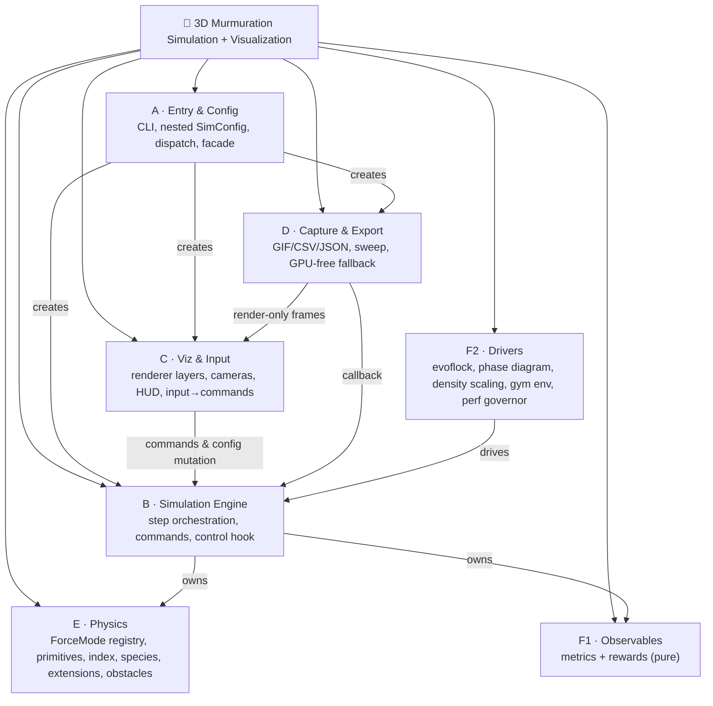
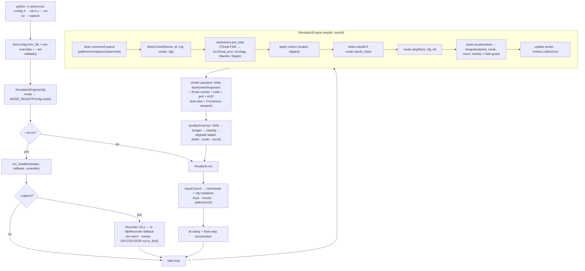
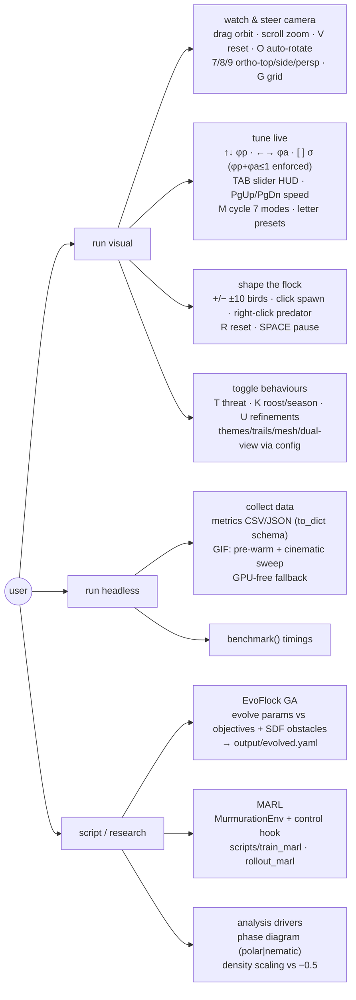

# Architecture — pymurmur

> **What this document is.** The architecture of pymurmur as built by the
> self-contained implementation roadmap in the audited
> spec-vs-code decision register in the
> [TODO/roadmap0.md](TODO/roadmap0.md)–[TODO/roadmap5.md](TODO/roadmap5.md)
> set. The P0–P14 implementation roadmap (formerly `roadmap_deepseek.md`)
> is complete — its history is preserved in git, not tracked as a live
> file. Docker/CI usage: [docker.md](docker.md). Test-tree layout and
> plan: [test.md](test.md).
>
> Both design views — Top-Down · Functional Decomposition · Macro→Micro ·
> Outside-In, and Bottom-Up · Component Assembly · Micro→Macro · Inside-Out —
> live in §2 of this document, which is the **single architecture
> reference**. This document is executable: the import matrix (§5), the
> config-usage drift scan, and the doc-link guard
> (`test/l4_crosscutting/guards/test_docs.py`) fail CI when code and this
> document diverge.

---

## 1. System Goal

Simulate starling flocks at any scale (150 → 300 000 birds) using **seven
interchangeable physics models**, with optional predator–prey species
dynamics and behavioural extensions (threat FSM, ecology with seasonal and
day-night models, wander, ripples). Visualise in real-time strict-3D
(z-up, ModernGL instanced rendering with impostors, trails, themes, HUD),
or run headlessly for scientific data collection with **physically
calibrated observables** (watts, joules, newtons) alongside dimensionless
order/opacity/robustness metrics. Deterministic under a seed. Serves two
research bridges without carrying their dependencies: **evolutionary
inverse design** (EvoFlock GA over an SDF obstacle world →
`output/evolved.yaml`) and **MARL** (gymnasium environment + per-bird
control hook; training stays external in `scripts/`).

**Does not do:** audio, VR/XR, networking, ML training in-core,
screensaver/desktop-overlay modes, GPU-compute simulation backends,
config-file editing (YAML → text editor). *(Excluded-tier record:
[TODO/roadmap5.md](TODO/roadmap5.md) Appendix A.)*

---

## 2. Two Complementary Design Views

Both views describe the same system; each is the *generator* of different
guarantees. The Macro→Micro view generates the **dependency rules and
subsystem contracts**; the Micro→Macro view generates the **testing pyramid
and composition conventions**. The test tree mirrors the views directly:
`test/l1_subsystems/` isolates the Level-1 subsystems below,
`test/l3_modules/` mirrors the module map (§4), and
`test/l4_crosscutting/guards/` enforces the dependency matrix (§5).

### 2.1 Top-Down · Functional Decomposition · Macro→Micro · Outside-In

**Level 0 — Goal** (§1) decomposes into **Level 1 — seven functional
subsystems** (the classic six, plus Analysis split into two tiers):



**Level 2 — subsystem contracts** (the load-bearing decisions):

- **A:** `SimConfig` is a **composition of per-subsystem dataclasses**
  (`domain, boundary, flock, projection, spatial, field, vicsek,
  influencer, angle, marl, threat, ecology, metrics, viz, capture, perf`).
  YAML sections map 1:1 to sub-configs — silent key-drops and cross-section
  collisions are structurally impossible; unknown keys warn; `validate()`
  clamps. Live-mutable fields are documented per sub-config docstring.
- **B:** `SimulationEngine.step()` *is* the frame diagram (§3) — it drains
  the command queue, builds a `StepContext`, runs extensions, applies
  external control, rebuilds the index if the mode wants it, runs the
  active `ForceMode`, integrates under the mode's declared policy, updates
  the smoothed centre, collects metrics. It imports nothing from C or D.
- **C/D:** optional layers. Rendering is **pure** (a render call never
  advances physics); input produces **commands and config mutations**, not
  direct simulation calls; capture reuses the visualizer's render-only
  frames and falls back to a matplotlib pipeline without GL.
- **E:** one registry of mode classes; one `SpatialIndex` protocol; one
  `Extension(ctx)` protocol; one flock state contract (§8).
- **F1/F2:** observables are pure functions of flock state (B may import
  them); drivers sit **above** B (they import the engine; never the other
  way).

**Level 3 — module interfaces** are the classes/protocols named in §4's
map; **Outside-In ordering** for a reader: start at `__main__.py` → user
flow (§11) → engine step (§3) → mode/extension internals.

### 2.2 Bottom-Up · Component-Based Assembly · Micro→Macro · Inside-Out

Built and tested from atoms upward; a component at level *n* depends only
on levels < *n* (no Level-1 assembly imports another Level-1 assembly).
**Composition is a DAG** — the historical `flock ↔ forces` cycle is gone
(orchestration lives in the engine).

```
Level 3  SYSTEM      __main__ CLI · pymurmur facade (Simulation, benchmark) · scripts/
Level 2  SUBSYSTEMS  SimulationEngine · Visualizer · Renderer3D · Recorder(+Mpl) ·
                     QualityGovernor · MurmurationEnv · EvoFlock
Level 1  ASSEMBLIES  PhysicsFlock (FlockArrays + SpatialIndex + rng + species + center) ·
                     7 ForceMode classes · ExtensionManager (Threat/Ecology/Wander/Ripple) ·
                     MetricsCollector · rewards · presets · obstacles (SDF scene)
Level 0  ATOMS       Vec3/FlockArrays/StepContext/InstanceSchema (types) ·
                     integrate() variants · force primitives (sep/align/coh/noise) ·
                     rotate_about (Rodrigues) · min_image · hash01/smoothstep ·
                     spherical-cap occlusion · steric · SDF primitives ·
                     numba kernels · normalize3/limit3 · fibonacci_sphere · seed_noise3
```

Level is defined by **import discipline, not file location** — the SDF
primitives are Level-0 atoms although they live in
`physics/obstacles.py` (zero project imports beyond `core/`).

**Micro→Macro conventions (the composition contract, enforced by tests):**
all neighbour indices are **global capacity-space** rows; the `active` mask
may have holes at any time and every assembly must be correct under it; all
randomness flows from the single seeded `flock.rng`; every Level-0 atom is
unit-tested against its documented formula before an assembly consumes it;
**no component merges without its composer** (no dead atoms). Build/test
order mirrors the tree: atoms and module mirrors (`test/l3_modules/`) →
wiring (`test/l2_integration/`) → subsystem isolation
(`test/l1_subsystems/`) → system/CLI/acceptance (`test/l0_system/`), with
the guards and perf budgets cross-cutting (`test/l4_crosscutting/`).

---

## 3. Application Logic & Flow



Headless and visual paths share the identical `step()`; capture and the
gym environment hook in via callback/controller without the engine knowing
them.

---

## 4. Module Map

```
pymurmur/                          # pip-installable package
├── __init__.py                # facade: SimConfig, SimulationEngine, Simulation(**kw), Recorder
├── __main__.py                # CLI: config resolution, --set/--print-config, --probe,
│                              #   env overrides, dispatch
│
├── core/                      # Level 0 shared — no project imports
│   ├── types.py               # Vec3, FlockArrays, StepContext, InstanceSchema,
│   │                          #   SpatialIndex Protocol, rotate_about, min_image,
│   │                          #   normalize3/limit3, hash01, smoothstep,
│   │                          #   fibonacci_sphere, seed_noise3, isfinite3
│   └── config.py              # nested SimConfig (+ sub-config dataclasses), YAML I/O, validate()
│
├── simulation/
│   └── engine.py              # SimulationEngine: step orchestration, command queue,
│                              #   control hook, fixed-step accumulator, run_headless,
│                              #   benchmark(), reset
│
├── physics/
│   ├── boid.py                # integrate(speed_mode|move|inertia|noise), boundaries
│   │                          #   (toroidal/open/margin/sphere/sphere_soft, centred on C),
│   │                          #   position-init variants (box/sphere/shell/gaussian/grid/blob),
│   │                          #   velocity-init variants (fixed/cube/speed_uniform/tangential/blob)
│   ├── flock.py               # PhysicsFlock (composes FlockArrays; rng, is_predator,
│   │                          #   center, prev_positions, last_accelerations, max_speed),
│   │                          #   SpatialHashGrid (modulo cells, incremental), KDTreeIndex (boxsize)
│   ├── occlusion.py           # spherical-cap occlusion with true visibility culling,
│   │                          #   union Θ, boundary-weighted δ̂  (pure numpy)
│   ├── steric.py              # clamped 1/d² repulsion            (pure numpy)
│   ├── obstacles.py           # SDF primitives + CSG scene, zero-crossing detection,
│   │                          #   kinematic correction
│   ├── forces/
│   │   ├── _mode.py           # ForceMode ABC (needs_index, speed_mode, owns_positions,
│   │   │                      #   reset/step), MODE_REGISTRY, @register
│   │   ├── _base.py           # corrected primitives: sep(unit/d²)/align/coh/noise(×scale),
│   │   │                      #   ForceTerm + composeForces
│   │   ├── _kernels.py        # numba JIT force kernels (use_numba; fastmath policy)
│   │   ├── projection.py      # Pearce: δ̂ + alignment + noise; refinements
│   │   ├── spatial.py         # Reynolds: hybrid filter, dual radii, jitter, species,
│   │   │                      #   physical pipeline order, parallel two-phase
│   │   ├── field.py           # 13-term blob field: anchors, leader/chaser, shell/cavity,
│   │   │                      #   slot repulsion, flow/fold, grid-sep normalization
│   │   ├── vicsek.py          # corrected update, predator-prey, asymmetric collisions
│   │   ├── influencer.py      # tick-driven Lissajous, move-then-steer, rank influence, pilot
│   │   ├── angle.py           # turn-rate steering, mode gating, adaptive speed, edges
│   │   └── marl.py            # deferred global rules under external control
│   └── extensions/
│       ├── _base.py           # Extension ABC — apply(flock, ctx: StepContext)
│       ├── predator.py        # Threat FSM (approach/egress, wake/split/wave bundle)
│       ├── ecology.py         # logistic dusk, temperature boost, coherence gate,
│       │                      #   seasonal size model, roost
│       ├── wander.py          # boundedUnitTravel attractor + heading
│       └── ripple.py          # enveloped travelling pulses (wraps field-mode impl)
│
├── viz/                       # optional; never imports simulation
│   ├── renderer.py            # ModernGL: InstanceSchema, _build_vao discipline,
│   │                          #   depth-FBO, layers, viewports, themes,
│   │                          #   meshes(tetra|winged|impostor), gradient bg
│   ├── shaders.py             # GLSL: LookAt+flap, impostor+depth cues, trail, grid, HUD
│   ├── trails.py              # 4 trail modes: velocity / accumulation / ring / lines
│   ├── camera.py              # OrbitCamera + ortho/projection presets + capture sweep
│   ├── hud.py                 # slider panel + readout quads (ortho pass)
│   ├── input_control.py       # keys/mouse/sliders → commands + cfg mutations
│   └── visualizer.py          # loop owner: accumulator feed, render-only frames, governor
│
├── capture/
│   ├── recorder.py            # GL path: pre-warm, sweep, GIF(optimize,disposal)/CSV/JSON
│   └── mpl_recorder.py        # GPU-free dual-view matplotlib fallback
│
└── analysis/
    ├── metrics.py             # F1: observables + FlockMetrics.to_dict() schema
    ├── rewards.py             # F1: weighted composite reward terms
    ├── presets.py             # F1: letter-key scenario table + themes
    ├── perf.py                # F2: PerfDiagnostics + QualityGovernor
    ├── evoflock.py            # F2: SSGA (crossover, worst-of-N, SDF objectives, islands)
    ├── phase_diagram.py       # F2: (η, D) sweep, polar|nematic
    ├── density_scaling.py     # F2: N-sweep vs ideal exponent −0.5
    └── gym_env.py             # F2: MurmurationEnv (lazy gymnasium)
```

### Repository layout (project root)

```
git_mur/
├── pymurmur/            # the package (above)
├── conf/                # shipped YAML presets (§10) + conf/examples/
├── output/              # captures, metrics, evolved.yaml — user-facing outputs
├── test/                # layered macro→micro (layout: test.md)
│   ├── conftest.py, helpers.py, regenerate_golden.py
│   ├── data/            # golden_<mode>[_sphere].npz
│   ├── l0_system/       # CLI, facade, e2e, config resolution, acceptance gates
│   ├── l1_subsystems/   # subsystem isolation (A–F)
│   ├── l2_integration/  # engine/capture/render/config wiring
│   ├── l3_modules/      # module mirrors: core, physics, simulation, viz, capture, analysis
│   └── l4_crosscutting/ # guards/ (architecture, docs, drift, golden, determinism,
│                        #   collection count) · perf/ (budgets, scaling, memory)
├── scripts/             # dependency-gated: train_marl.py, rollout_marl.py, run_evoflock_small.py
├── ci/                  # Docker + Compose (see docker.md)
├── .github/workflows/   # test.yml + guard-rails.yml (9 jobs, merge-blocking summary)
├── sci/                 # source papers (PDF provenance)
├── arch.md              # this file — single architecture reference
└── TODO/                # roadmap0–5: audited contract/spec set with per-item status ·
                         #   roadmap6: remaining delta (scaling S8, guard extensions T7)
```

---

## 5. Dependency Rules  *(enforced by `test/l4_crosscutting/guards/test_architecture.py`)*

The guard encodes a **module-level** `ALLOWED_EDGES` matrix (an import
from A to B must match an allowed prefix; `TYPE_CHECKING` imports count)
plus named `FORBIDDEN_EDGES`. Subpackage summary:

```
core/                    → numpy/stdlib only
physics/boid             → core                      (never flock/forces)
physics/occlusion|steric → core                      (pure numpy)
physics/obstacles        → core
physics/forces/*         → physics primitives, core  (read flock arrays; no cKDTree
                                                      construction — use flock.index)
physics/flock            → core, physics/boid        (NEVER forces — the cycle is dead)
physics/extensions       → physics/flock(read), core
simulation/engine        → physics/*, analysis/{metrics,rewards}, core
analysis/{metrics,rewards,presets}  → physics/flock(read), core        (tier F1)
analysis/{perf,evoflock,phase_diagram,density_scaling,gym_env}
                         → simulation, core                             (tier F2)
viz/                     → core, physics/flock(read), analysis/presets  (never simulation*)
capture/                 → simulation, viz, core
__main__ / scripts       → everything
```

\* `viz/visualizer.py` holds an engine *reference* handed in by `__main__`
(it calls `step()`/enqueues commands) but imports no simulation modules;
`input_control` communicates exclusively through config mutation and the
command queue. Additional enforced rules: no module-level `np.random.*`
outside test helpers; no `(…, 2)`-shaped spatial arrays in `physics/`
(strictly-3D guard, also a standalone CI job); every config leaf field
read somewhere (usage-drift scan). The full guard set runs as
`.github/workflows/guard-rails.yml` — ten jobs (`guard-rail-dag`,
`guard-rail-golden`, `guard-rail-config-drift`, `guard-rail-3d`,
`guard-rail-doc-links`, `guard-rail-collection-count`, `guard-rail-mypy`,
`guard-rail-evolved`, `guard-rail-composers`) with a merge-blocking
`guard-rails-summary` gate (per-job description: [docker.md](docker.md) §CI).

---

## 6. Force Modes  *(one class per file; `@register` → `MODE_REGISTRY`)*

| Mode | Mechanism | needs_index | speed_mode | owns_positions | Per-mode state | 300K target |
|------|-----------|:---:|:---:|:---:|----------------|:---:|
| **projection** | Pearce δ̂ (culled occlusion) + alignment + noise | yes (topological σ) | band | no | — | ~13 ms |
| **spatial** | Reynolds hybrid-filter sep/align/coh (+species, jitter, kernels) | yes (radius+cap) | band \| ceiling \| fixed | no | — | ~17 ms (numba) |
| **field** | 13-term blob/anchor field (anchors, leader/chaser, shell, ripples…) | no | band + inertia | no | t, group cache | ~3 ms |
| **vicsek** | angle coupling η, tangent-plane noise D, predator–prey, collisions | yes (radius) | fixed | no | — | ~17 ms |
| **influencer** | tick-driven Lissajous target, rank influence, move-then-steer | no | fixed | **yes** | tick, pilot | ~1 ms |
| **angle** | turn-rate-limited heading steering, mode gating, adaptive speed | yes (knn) | fixed (per-bird s) | no | last_cell grid | ~8 ms |
| **marl** | deferred global rules under external per-bird control | yes (sep radius) | none | no | — | ~2 ms |

Runtime: `M` cycles `sorted(MODE_REGISTRY)` (= angle, field, influencer,
marl, projection, spatial, vicsek); each mode reads only its own
sub-config. Adding a mode = one file + `@register`.

---

## 7. Behavioural Extensions

`Extension.apply(flock, ctx: StepContext)` — live-toggleable each frame via
config; all stochastic draws from `ctx.rng`.

| Extension | Provides | Publishes |
|-----------|----------|-----------|
| **Threat** | FSM predator (approach/egress, pass-through, arc), push/wake/split/wave bundle | `ctx.threat_prox` (drives panic & blackening) |
| **Ecology** | logistic dusk roost (temperature-boosted), coherence gate on weights, seasonal flock-size model, per-day predator presence | `predator_active` property |
| **Wander** | boundedUnitTravel attractor (‖path‖ ≤ 1) + flock heading | wander_center/heading |
| **Ripple** | enveloped, twisting, travelling density pulses | envelope sum (fold-noise coupling) |

---

## 8. Data Representation

Flat **Structure of Arrays** on `PhysicsFlock` (composing `FlockArrays`);
no per-bird Python objects.

```
positions           (N,3) float32     3.6 MB @ 300K
velocities          (N,3) float32     3.6 MB
accelerations       (N,3) float32     3.6 MB
prev_positions      (N,3) float32     3.6 MB   (MSD unwrap, ring trails, interpolation)
last_accelerations  (N,3) float32     3.6 MB   (physical metrics see pre-reset a)
seeds               (N,)  float32     1.2 MB   (field phases, per-bird hue, hashes)
max_speed           (N,)  float32     1.2 MB   (panic ceilings; None → scalar v0)
active              (N,)  bool        0.3 MB   (holey masks are first-class)
is_predator         (N,)  bool        0.3 MB   (species column)
                                     ≈ 21 MB   (+ index + GPU instance buffer)
```

Plus: `rng` (single seeded `np.random.Generator` — the only randomness
source; integer seeds honored incl. 0, `None` → fresh entropy), `center`
(exponentially smoothed centroid), `index` (`SpatialIndex`: modulo-celled
hash grid or boxsize-aware cKDTree, both returning **global** indices),
per-mode state on ForceMode instances. The memory-audit test
(`test/l4_crosscutting/perf/test_performance.py`) pins the 300K budget;
extending the audited-array inventory to this full column list is tracked
as roadmap6 S8.3.

**Hot path:** two-pass — batched index query (Python/scipy) → vectorised
numpy or numba JIT kernel (`perf.use_numba`; `fastmath` only when no
metrics are exported). Minimum-image arithmetic everywhere distances
cross the toroidal seam.

---

## 9. Libraries

| Library | Why | Required? |
|---------|-----|:---:|
| `numpy` | SoA arrays, vectorised math | yes |
| `scipy` | cKDTree (boxsize), ConvexHull (hull-τρ), eigh | yes |
| `PyYAML` | nested config I/O | yes |
| `numba` | JIT force kernels (N ≥ 50K) | opt-in (`perf.use_numba`) |
| `pygame` | window, events, clock | viz only |
| `moderngl` | instanced rendering, FBO, HUD | viz only |
| `PyGLM` | camera matrices (`_mat4_bytes` upload) | viz only |
| `Pillow` | FBO readback, GIF assembly | capture only |
| `matplotlib` | GPU-free capture fallback, analysis plots | capture-fallback / analysis |
| `gymnasium` | MARL env wrapper | opt-in (lazy import) |
| `stable-baselines3` | example training scripts only | scripts/ only |
| `PyTorch` | — | excluded |

Version pins: [requirements.txt](requirements.txt),
[requirements-optional.txt](requirements-optional.txt),
[requirements-test.txt](requirements-test.txt).

---

## 10. Shipped Config Presets (`conf/`)

| File | Mode | Birds | Key feature |
|------|------|:---:|------|
| `murmuration.yaml` | projection | 150 | Pearce occlusion (true culling) — the default |
| `murmuration_spatial.yaml` | spatial | 200 | Reynolds + threat |
| `murmuration_field.yaml` | field | 16K | full 13-term blob dynamics |
| `field_quiet_roost / lava_lamp / ink_cloud / predator_ripple / vacuole / silk_sheet / storm_turn.yaml` | field | 3K–18K | the seven field character presets |
| `murmuration_vicsek.yaml` | vicsek | 101 | predator–prey, phase transition |
| `murmuration_influencer.yaml` | influencer | 200 | Lissajous pursuit, alpha-density rendering |
| `murmuration_evo.yaml` | spatial (GA) | 200 | SSGA + SDF obstacle course (confined) |
| `evo_open.yaml` | spatial (GA) | 200 | open-boundary GA evaluation variant |
| `murmuration_300k.yaml` | spatial | 300K | cKDTree + numba benchmark config |
| `conf/examples/murmuration_nested.yaml` | — | — | nested-schema reference example |

Angle and marl modes run from any preset via `--set mode=angle` /
`--set mode=marl`; dedicated source-parity presets for them (plus
starlings/boids regime presets) are specified in
[TODO/roadmap2.md](TODO/roadmap2.md) and not yet shipped. Presets load
exactly as written (documented-intent policy); every preset's domain and
per-section sentinels are asserted by `test/l0_system/test_config_files.py`.

---

## 11. CLI & Programmatic Surface

```
python -m pymurmur                                   # defaults (projection, N=150)
python -m pymurmur --config field                    # conf/murmuration_field.yaml
python -m pymurmur --config /path/custom.yaml
python -m pymurmur --set spatial.separation_weight=6 --set flock.num_boids=500
python -m pymurmur --print-config                    # resolved effective config
python -m pymurmur --list-configs                    # discovered presets
python -m pymurmur --probe                           # capability report (GL/numba/scipy)
python -m pymurmur --no-viz [--capture]              # headless [+ GIF/CSV/JSON]
python -m pymurmur --capture-output out.gif --capture-frames 120
python -m pymurmur --fullscreen --light-scheme
# env overrides (capture farm / llvmpipe docker service):
CAPTURE_W=400 CAPTURE_H=300 CAPTURE_FRAMES=120 CAPTURE_OUT=out.gif …
# precedence: YAML < env < CLI
```

```python
import pymurmur
sim = pymurmur.Simulation(num_boids=200, mode="spatial", seed=42)
timings = sim.benchmark(num_steps=1000)          # render-free per-step seconds
from pymurmur.analysis.gym_env import MurmurationEnv   # lazy gymnasium
```

### What the user can do



---

## 12. Extension Points

| To add… | Do this (one seam each) |
|---------|------------------------|
| force mode | new file in `forces/`, subclass `ForceMode`, `@register` (declares needs_index/speed_mode/owns_positions); add its edges to `ALLOWED_EDGES` |
| behavioural extension | subclass `Extension`, register in `ExtensionManager`; read everything from `ctx` |
| metric | field on `FlockMetrics` + fill in `collect()`; auto-exported via `to_dict()` |
| reward term | named term in `analysis/rewards.py` + weight in `MarlConfig` |
| spatial index | implement `SpatialIndex` Protocol; must pass the shared conformance suite |
| bird mesh / render layer | mesh entry in `shaders.py` + viz config; `draw_layer` for overlays |
| obstacle shape | SDF function in `physics/obstacles.py` (+ compose via min/max) |
| boundary mode | branch in `physics/boid.py` boundary dispatch |
| config preset | drop nested YAML in `conf/` (auto-discovered; validated by tests) |
| input binding | `input_control` → command or config mutation (never engine calls) |

Every new module lands with its mirrored test
(`test/l3_modules/<subpackage>/`) and, if it moves test counts, a
deliberate update to the collection-count pins
(`test/l4_crosscutting/guards/test_collection_count.py`).

---

## 13. Determinism, Safety & Scaling

**Guarantees (test-backed):** same seed → bit-identical trajectories per
mode; golden trajectories pinned per mode (`test/data/`, `atol=1e-3`,
re-pinned only with deliberate physics changes, CI-guarded); strictly-3D
(AST guard + `depth > 0` validation); holey `active` masks safe
everywhere; `dt` clamped (≤ 1/20) behind a fixed-step accumulator;
non-finite positions self-heal to `flock.center`; renderer never mutates
simulation state.

**Adaptive quality:** EMA frame stats (250 ms spike cap) → budget
`1000/max(24, target_fps)` → risk classification → degradation ladder
(trails off → render scale −0.15, floor 0.75 → N −18 %, floor 512) under
78 %-for-1.8 s hysteresis, 3.6 s recovery.

**Scaling ladder** (guarded by `test/l4_crosscutting/perf/`):

| Checkpoint | N | Key mechanism | Target |
|-------|----|---------------|:---:|
| 1 | 150 | hash grid, numpy forces | 60 fps |
| 2 | 1 500 | SoA, vectorised integrate | 60 fps |
| 3 | 16 000 | boxsize cKDTree, batched two-phase queries | 60 fps |
| 4 | 50 000 | numba JIT kernels (`perf.use_numba`) | 45 fps |
| 5 | **300 000** | full SoA + cKDTree(workers) + numba + instance buffer | 30 fps |

All five checkpoints, the full determinism matrix (threads × jitter × numba
+ subprocess leg), and the T6.3/S8.4 soak tiers are implemented and
verified (2026-07-21).

---

